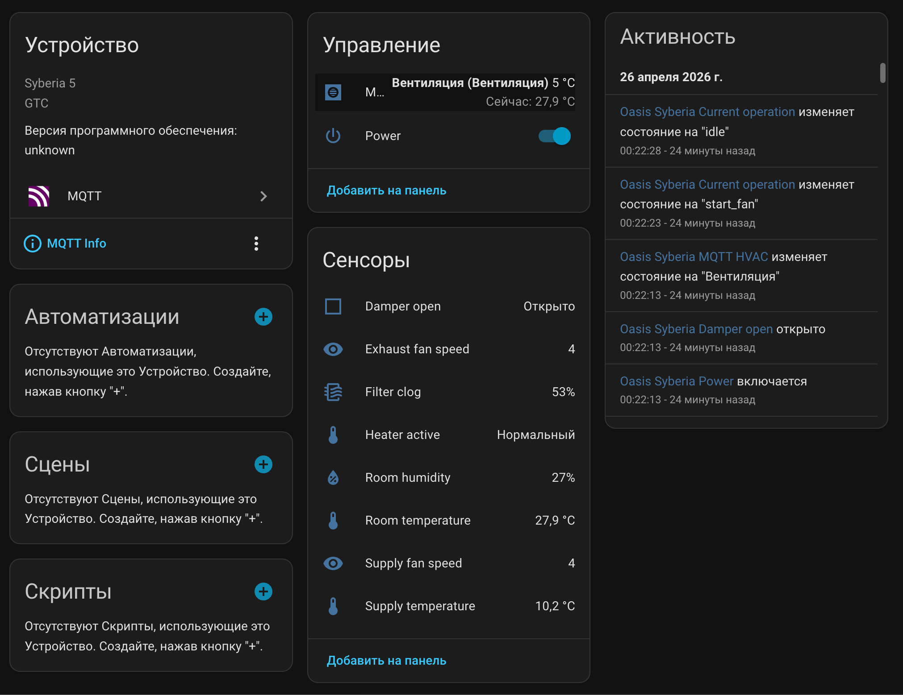
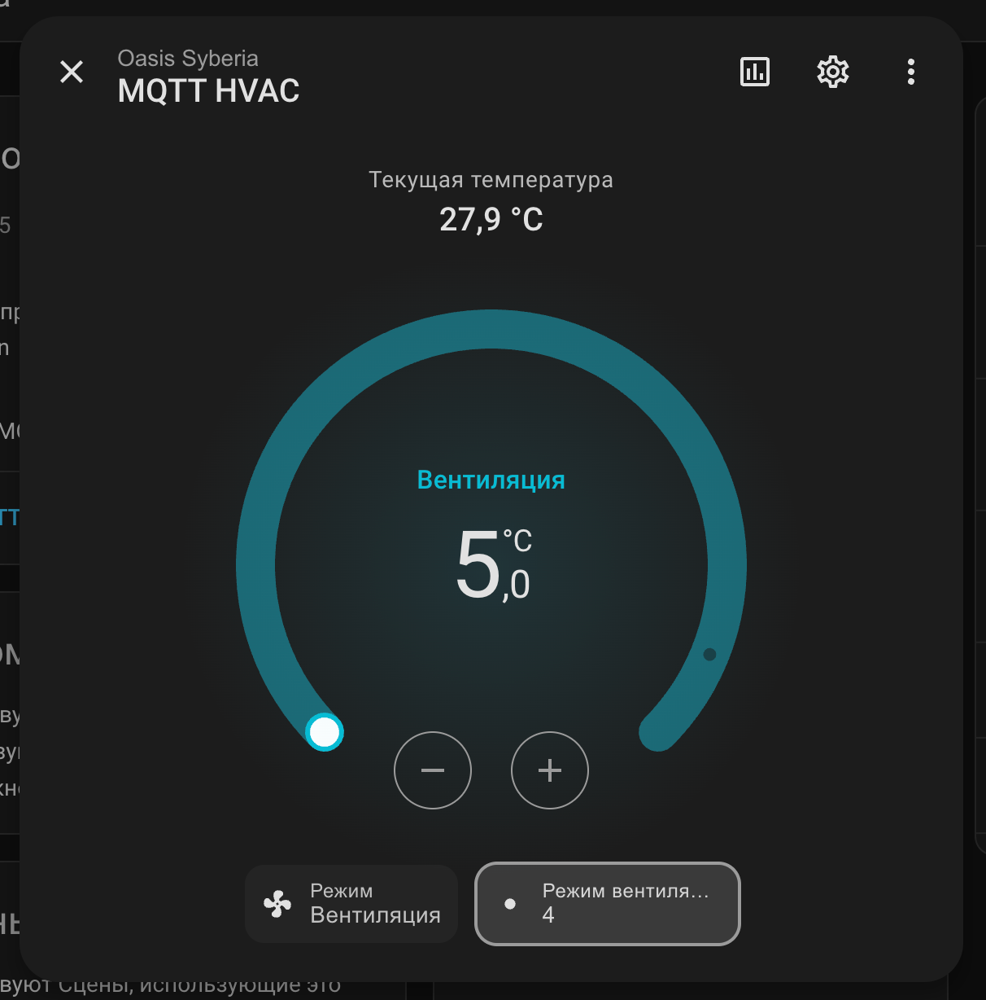
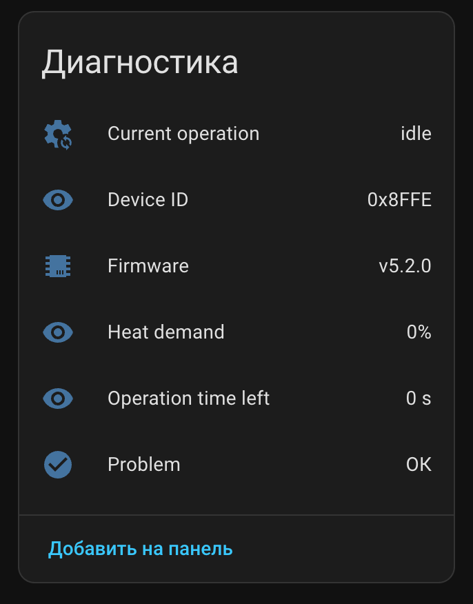
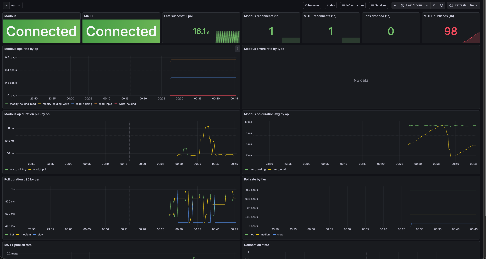

# oasis-modbus2mqtt

[](https://github.com/alexmorbo/oasis-modbus2mqtt/actions/workflows/ci.yml)
[](https://pkg.go.dev/github.com/alexmorbo/oasis-modbus2mqtt)
[](#license)

A Go service that bridges a **GTC Oasis Syberia v5** HVAC controller (Modbus TCP) into **Home Assistant** via MQTT discovery — one HA device with climate, switch, sensors, and binary sensors automatically registered.

Replaces Home Assistant's native `modbus:` YAML integration with a self-healing service that handles the controller's quirks (single-TCP-connection, edge-triggered Power register, RMW for mode bits, transition states) so the rest of HA doesn't have to.

## Screenshots

| Home Assistant overview | Climate control | Diagnostics |
|---|---|---|
|  |  |  |

Grafana dashboard (one device → all bridge metrics on one screen):



The Grafana dashboard JSON ships in [`grafana/oasis.json`](grafana/oasis.json) — drop it into Grafana via *Dashboards → New → Import*, or apply it via grafana-operator / Terraform `grafana_dashboard` resource. It assumes a Prometheus-compatible datasource named `vm` and the bridge metrics on `oasis_*` (the default).

## Status

Running in production on the author's homelab against a real GTC Oasis Syberia 5 (firmware v5.2.0). Treat as **0.x — API may evolve**. Hardware-specific decoding is reverse-engineered; PRs welcome for other Oasis variants.

## What it does

- Maintains exactly **one** Modbus TCP connection to the controller (the device refuses concurrent clients).
- Polls registers on a tiered schedule (5 s / 15 s / 60 s) and decodes them into a typed `Snapshot`.
- Publishes `homeassistant/.../config` MQTT discovery for ~16 entities — climate, power switch, supply/room temperature, room humidity, supply/exhaust fan speed, filter clog %, heat demand, current operation, firmware, device id, plus heater-active / damper-open / problem binary sensors.
- Subscribes to HA command topics (`cmd/power`, `cmd/hvac_mode`, `cmd/target_temperature`, `cmd/fan_target`) and translates them to Modbus writes — including the **edge sequence** required by `Power_Dev` and the **read-modify-write** required by `Dev_Keys_2`.
- Holds an automatic reconnect supervisor with exponential backoff + jitter for both Modbus and MQTT, surfaces `availability=online/offline` (LWT-backed) so HA correctly greys-out entities when the bridge is down.
- Refuses writes while the controller is in a transition phase (`close_damper`, `electric_calorifier_purge`, …) and exposes the current operation as a sensor so users can see *why*.
- Ships `/health/live`, `/health/ready`, and `/metrics` (VictoriaMetrics-compatible) for k8s probes and Prometheus scraping.

## Architecture (one screen)

```
                +---------------------+
                | Home Assistant      |
                | (MQTT discovery)    |
                +----------+----------+
                           | MQTT
                           v
                +---------------------+
                | MQTT broker         |
                | (e.g. Mosquitto)    |
                +----------+----------+
                           ^
                  publish  | subscribe
                  state +  | cmd/*
                  discovery|
                           |
+---------+   poll/write   v       Modbus TCP    +-------------------+
| Poller  +---->  Bridge  +---------------------->| GTC Oasis Syberia |
+---------+                                       | v5 controller     |
   3 tiers      |   ConnectionSupervisor          +-------------------+
                |   reconnect + backoff
                v
            CommandDispatcher
            (failure threshold → trigger supervisor)
```

Code organisation follows Clean Architecture (`domain` → `application` → `infrastructure` → `interface`). `cmd/server/main.go` is a thin wiring entry point.

## Quick start

### Docker

```bash
docker run --rm \
  -p 8080:8080 \
  -e MODBUS_HOST=<controller-ip> \
  -e MQTT_BROKER=<broker-host:1883> \
  -e MQTT_CLIENT_ID=oasis-modbus2mqtt \
  -e HA_DEVICE_PREFIX=oasis_syberia \
  ghcr.io/alexmorbo/oasis-modbus2mqtt:latest
```

Multi-arch images (`linux/amd64`, `linux/arm64`) are published to `ghcr.io/alexmorbo/oasis-modbus2mqtt`. Tags include `latest` (default branch), `<sha-short>` (every push), and `vX.Y.Z` / `X.Y.Z` / `X.Y` for git tags matching `v*`.

### Build from source

```bash
make build           # ./bin/oasis-modbus2mqtt
make docker-build    # oasis-modbus2mqtt:latest
make test            # unit + race
make test-coverage   # coverage report
make lint            # golangci-lint v2
make tidy            # go mod tidy
```

Requires Go 1.25+.

## Configuration

All configuration is via environment variables. Defaults in parens.

| Var | Default | Description |
|---|---|---|
| `MODBUS_HOST` | _required_ | Controller IP / hostname |
| `MODBUS_PORT` | `502` | Modbus TCP port |
| `MODBUS_SLAVE_ID` | `1` | Slave address |
| `MODBUS_CONNECT_TIMEOUT` | `5s` | TCP connect timeout |
| `MODBUS_READ_TIMEOUT` | `2s` | Per-read timeout |
| `MODBUS_WRITE_TIMEOUT` | `2s` | Per-write timeout |
| `MODBUS_GUARD_INTERVAL` | `100ms` | Min interval between Modbus ops (vendor recommendation) |
| `MQTT_BROKER` | _required_ | `host:port` |
| `MQTT_CLIENT_ID` | `oasis-modbus2mqtt` | Must be unique per broker |
| `MQTT_USERNAME` | `` | Empty → anonymous |
| `MQTT_PASSWORD` | `` | Empty → anonymous |
| `MQTT_KEEPALIVE` | `30s` | Paho keepalive |
| `MQTT_QOS` | `1` | QoS for state and command topics |
| `HA_DISCOVERY_PREFIX` | `homeassistant` | HA MQTT discovery prefix |
| `HA_DEVICE_PREFIX` | `oasis_syberia` | `object_id` namespace |
| `HA_DEVICE_NAME` | `Oasis Syberia` | Display name |
| `HA_MANUFACTURER` | `GTC` | |
| `HA_MODEL` | `Syberia 5` | |
| `POLL_HOT_INTERVAL` | `5s` | Tier 1: state + filter + fans + target |
| `POLL_MEDIUM_INTERVAL` | `15s` | Tier 2: room temp/hum + extra errors + mode |
| `POLL_SLOW_INTERVAL` | `60s` | Tier 3: firmware + device id + Type_Dev |
| `AVAILABILITY_THRESHOLD` | `30s` | Stale snapshot → publish `offline` |
| `HTTP_PORT` | `8080` | `/health/*` + `/metrics` |
| `LOG_LEVEL` | `info` | `debug` / `info` / `warn` / `error` |
| `RECONNECT_MIN_DELAY` | `1s` | Modbus reconnect backoff start |
| `RECONNECT_MAX_DELAY` | `60s` | Backoff cap |
| `RECONNECT_FACTOR` | `2.0` | Backoff multiplier |
| `RECONNECT_JITTER_PCT` | `0.2` | ±jitter ratio |

## Migrating from HA's native `modbus:` integration

The Oasis Syberia controller permits **only one** TCP client — you cannot run HA's `modbus:` block and this bridge at the same time. Sequence:

1. **Back up** `configuration.yaml`, `scripts.yaml`, and any related `automations.yaml` entries.
2. Comment out the `modbus:` top-level block, the `template:` ventilation entries, and any `script:`s that called `modbus.write_register`.
3. Disable any automation that polls / restarts the modbus integration (if you have one — set `initial_state: false`).
4. Restart Home Assistant — the controller's TCP socket is now free.
5. Deploy this bridge (Docker, k8s, systemd — pointed at the same controller).
6. Within ~60 s the bridge connects, publishes discovery, and a single device "Oasis Syberia" appears in HA with its entities.
7. Verify the climate entity (mode change, target temperature, fan speed) and dashboard sensors before removing the old YAML permanently.

## HA entities published

| Entity | Type | Notes |
|---|---|---|
| `climate.oasis_syberia` | climate | modes `off`/`heat`/`fan_only`, fan modes `1..10`, target 5–30 °C |
| `switch.oasis_syberia_power` | switch | `Power_Dev` master toggle |
| `sensor.oasis_syberia_supply_temperature` | sensor (°C) | corrected supply duct T1 |
| `sensor.oasis_syberia_room_temperature` | sensor (°C) | from controller's wall remote |
| `sensor.oasis_syberia_room_humidity` | sensor (%) | from wall remote |
| `sensor.oasis_syberia_supply_fan_speed` | sensor | actual speed reported by controller |
| `sensor.oasis_syberia_exhaust_fan_speed` | sensor | actual exhaust speed |
| `sensor.oasis_syberia_filter_clog` | sensor (%) | filter wear from controller's pressure sensor |
| `sensor.oasis_syberia_heat_demand` | sensor (%) | PID demand for heating |
| `sensor.oasis_syberia_operation_time_left` | sensor (s) | seconds until current transition completes |
| `sensor.oasis_syberia_current_operation` | sensor (text) | `idle` / `close_damper` / `preheat_calorifier` / … |
| `sensor.oasis_syberia_firmware` | sensor (diagnostic) | e.g. `v5.2.0` |
| `sensor.oasis_syberia_device_id` | sensor (diagnostic) | hex device id |
| `binary_sensor.oasis_syberia_heater_active` | binary_sensor (heat) | electric heater pulsing |
| `binary_sensor.oasis_syberia_damper_open` | binary_sensor (opening) | inlet damper |
| `binary_sensor.oasis_syberia_problem` | binary_sensor (problem, diag.) | any `Error_Code_*` bit set |

## Observability

- **Logs** — structured JSON via `log/slog` to stdout. Levels: `INFO` for lifecycle (connect, discovery, online/offline, command applied), `WARN` for transient errors and command rejections, `ERROR` for fatal.
- **Metrics** — Prometheus scrape on `:8080/metrics`. Notable series:
  - `oasis_modbus_ops_total{op,status}`, `oasis_modbus_op_duration_seconds{op}`, `oasis_modbus_errors_total{type}`
  - `oasis_modbus_reconnects_total`, `oasis_modbus_connected` (gauge 0/1)
  - `oasis_mqtt_publishes_total`, `oasis_mqtt_reconnects_total`, `oasis_mqtt_connected`
  - `oasis_poll_duration_seconds{tier}`, `oasis_last_successful_poll_unix_nanos`
- **Health probes** — `/health/live` always 200; `/health/ready` 503 when MQTT is disconnected or the latest snapshot is older than 120 s.

## Hardware compatibility

Tested against firmware `v5.2.0` (`0x5200`) of the GTC Oasis Syberia 5. The bit layouts and register addresses are encoded in `domain/catalog/registers.go` and the bit decoders in `domain/entity/`.

The controller has several quirks the bridge handles for you:

- **Single TCP client only** — concurrent connections fail with `Connection refused`.
- **Power_Dev (h2) is edge-triggered** — turning OFF requires `write 1 → wait ≥100 ms → write 0`; turning ON is a single `write 1`. The register always reads back as 0.
- **Dev_Keys_2 (h86) needs RMW** — bits 0..1 are mode; bits 2..15 carry timer/humidifier/CO₂ settings that must be preserved.
- **TCP idle timeout ~5–10 s** — the bridge's hot-tier 5 s poll doubles as a keepalive.
- **Transition states are not writeable** — during `close_damper` / `electric_calorifier_purge` / `preheat_calorifier` the controller acknowledges writes but ignores them. The bridge rejects commands with a clear error during these phases; the `current_operation` sensor surfaces the reason in HA.

If your Oasis variant has different register addresses, edit `domain/catalog/registers.go` and the bit catalog in `domain/entity/error_code.go`.

## Project layout

```
cmd/server/         — main entrypoint
internal/app/       — DI wiring + lifecycle
domain/             — value objects, entities, register catalog (no I/O)
application/
  port/             — interfaces (ModbusClient, MQTTPublisher, Clock, …)
  dto/              — Command DTOs
  usecase/          — PollController, ApplyCommand, PublishState, PublishDiscovery
  service/          — CommandDispatcher, ConnectionSupervisor, Poller, AvailabilityManager
infrastructure/
  config/           — env-var loader
  logger/           — slog setup
  metrics/          — VictoriaMetrics counters/histograms/gauges
  modbus/           — grid-x/modbus client wrapper (mutex, guard interval, RMW)
  mqtt/             — paho client wrapper (LWT, auto-reconnect, sub registry)
  discovery/        — HA discovery payload builder
interface/
  http/             — Gin router, /health, /metrics
  mqtt/             — command subscriber → Apply
tests/e2e/          — full-loop test (mbserver + mosquitto via testcontainers)
documentation/      — design notes, per-feature stories
```

## Contributing

Issues and PRs welcome. Coverage is currently above 80 % overall, with most application/usecase and domain packages at 95 %+. Please:

- Run `make lint test` before pushing.
- Add or update unit tests for any behavioural change.
- Tag releases with `vX.Y.Z` — CI builds and pushes the corresponding image automatically.

## License

MIT — see [LICENSE](LICENSE).
